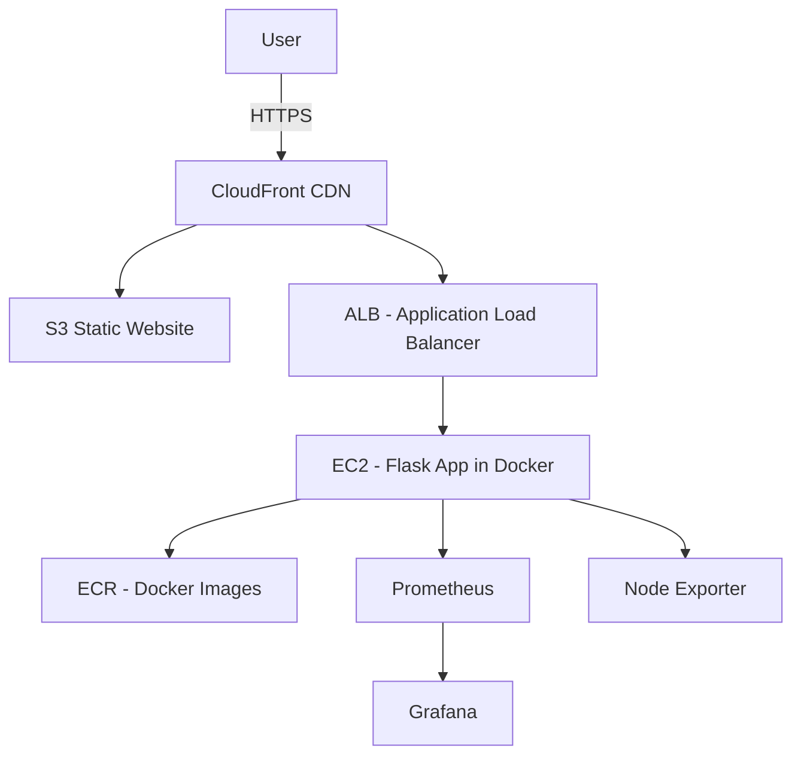

# Flask ToDo App Infrastructure 🚀  

This project demonstrates how to deploy and manage a **Flask-based ToDo application** with a fully automated **DevOps pipeline**.  

The stack combines **Terraform** for infrastructure as code, **Ansible** for provisioning, **Docker** for containerization, and **Prometheus/Grafana** for monitoring. Additionally, a **static website is hosted on S3 with CloudFront CDN** for global content delivery.  

---

## 🔧 Tech Stack  

- **Terraform** → Infrastructure provisioning (VPC, EC2, ALB, IAM, ECR, S3, CloudFront).  
- **Ansible** → Automates configuration & provisioning of EC2 instances.  
- **Docker** → Containerizes the Flask ToDo app for consistent deployments.  
- **Prometheus & Grafana** → Monitoring and visualization of app + system metrics.  
- **AWS Services**:
  - **EC2** → Hosts the Dockerized app and monitoring stack.  
  - **ECR** → Stores Docker images.  
  - **IAM** → Roles & permissions for services.  
  - **ALB (Application Load Balancer)** → Routes traffic to app instances.  
  - **S3 + CloudFront** → Serves static frontend assets via CDN.  

---

## 📂 Project Structure  

```
├── .github
    ├── workflows          # CI/CD Pipeline 
├── main.tf                # Root Terraform configuration
├── modules/
│   ├── alb/               # Application Load Balancer
│   ├── ec2/               # EC2 instances for app
│   ├── s3/                # S3 bucket for static website
│   ├── cloudfront/        # CloudFront distribution
│   ├── iam/               # IAM roles & policies
│   ├── ecr/               # Elastic Container Registry 
│   ├── monitoring/        # Monitoring instance and app
setup
├── ansible/               # Ansible playbooks for provisioning
├── docker/                # Dockerfiles for Flask app
├── app/                   # Flask ToDo app source code
├── ecr/                   # Elastic Container Registry
└── README.md              # Documentation
```

---

## ⚙️ Deployment Workflow  

1. **Infrastructure Setup (Terraform)**  
   - Provision EC2 instances, IAM roles, ECR, ALB, S3, and CloudFront.  
   - Example snippet from `main.tf`:  
     ```hcl
     module "static_website" {
       source      = "./modules/s3"
       bucket_name = var.cloudfront_config.bucket_name
       environment = var.environment
     }
     ```

2. **Provisioning (Ansible)**  
   - Install dependencies (Docker, Node Exporter, monitoring agents).  
   - Configure Flask app environment on EC2.
   - Configure ecr Repository

3. **Containerization (Docker + ECR)**  
   - Build Flask ToDo app image.  
   - Push to **Amazon ECR**.  
   - Deploy containers on EC2 with **Docker Compose**.

4. **Monitoring (Prometheus + Grafana)**  
   - Prometheus scrapes metrics from Node Exporter & Flask app.  
   - Grafana visualizes system and app performance dashboards.  

5. **Static Website (S3 + CloudFront)**  
   - React/HTML frontend assets hosted on **S3 bucket**.  
   - Delivered globally using **CloudFront CDN** with HTTPS.

---

## 📊 Monitoring  

- **Node Exporter** → Exposes EC2-level metrics.  
- **Prometheus** → Collects metrics (EC2, Docker, app).  
- **Grafana** → Dashboards for CPU, memory, requests/sec, error rates.  

---

## 🚀 How to Run  

1. **Clone repo**
   ```bash
   git clone https://github.com/your-username/your-repo.git
   cd your-repo
   ```
2. **Configure AWS CLI**
   ```bash
   aws configure
   ``` 

3. **Terraform apply**
   ```bash
   terraform init
   terraform apply -auto-approve
   ```

4. **Provision EC2 via Ansible**
   ```bash
   ansible-playbook -i inventory playbook.yml
   ```

5. **Deploy app container**
   ```bash
   docker-compose up -d
   ```

6. **Access the app**
   - Flask app: `http://<alb-dns-name>`  
   - Grafana: `http://<monitoring-ec2-ip>:3000`  
   - Prometheus: `http://<monitoring-ec2-ip>:9090`  
   - Static website: `https://<cloudfront-domain>`  

---

## 📌 Future Improvements  
 
- Configure **alerts in Grafana** (Slack/Email).  
- Harden IAM policies with least privilege principle.  

---

## 🏗️ Architecture Diagram  




---

## CI/CD Pipeline (GitHub Actions)

This project uses **GitHub Actions** to automate the CI/CD pipeline.  
The workflow includes:
- Linting and testing the Flask application.  
- Building and pushing Docker images to Amazon ECR.  
- Running Terraform commands to provision/update infrastructure.  
- Using Ansible for application deployment and configuration.  

The pipeline ensures smooth integration and deployment with every push to the repository.

---

## Repository

GitHub Repository: [Terraform_Todo](https://github.com/Prateeknayak04/Terraform_Todo.git)
